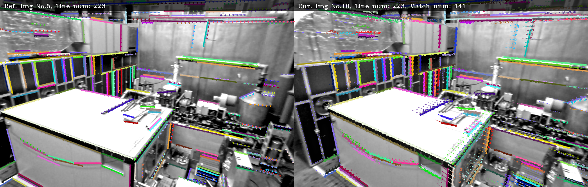

# Line Matching
A KLT-based line segment matching algorithm.

Related project: [EDLine Parallel](https://github.com/HanjieLuo/EDLine_parallel)



## References ## 
Papers Describing the Approach:

罗汉杰. 直线段匹配方法、装置、存储介质及终端[P]. 中国专利: CN109919190A, 2019-06-21.
http://luohanjie.com/2021-02-04/a-klt-based-line-segment-matching-algorithm.html

## Requirements ##
The code is tested on Ubuntu 14.04. It requires the following tools and libraries: CMake, OpenCV 3.4. 

## Building ##

```
#!bash
git clone https://github.com/HanjieLuo/line_matching.git
cd line_matching
mkdir build
cd build
cmake  ..
make
```

Test:

```
#!bash
./bin/test_line_matching
```

Test with EuRoc MAV dataset(MH_04_difficult):  
[](https://youtu.be/3i1zt2bkSZc "KLT-based Line Segment Matching Algorithm(Debug)")

[](https://youtu.be/OQyB3OdJg4w "KLT-based Line Segment Matching Algorithm")

## Contact information ##
Hanjie Luo [luohanjie@gmail.com](mailto:luohanjie@gmail.com)
